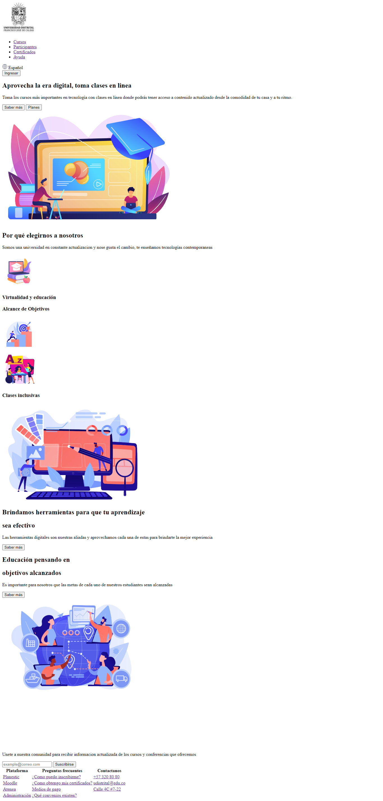
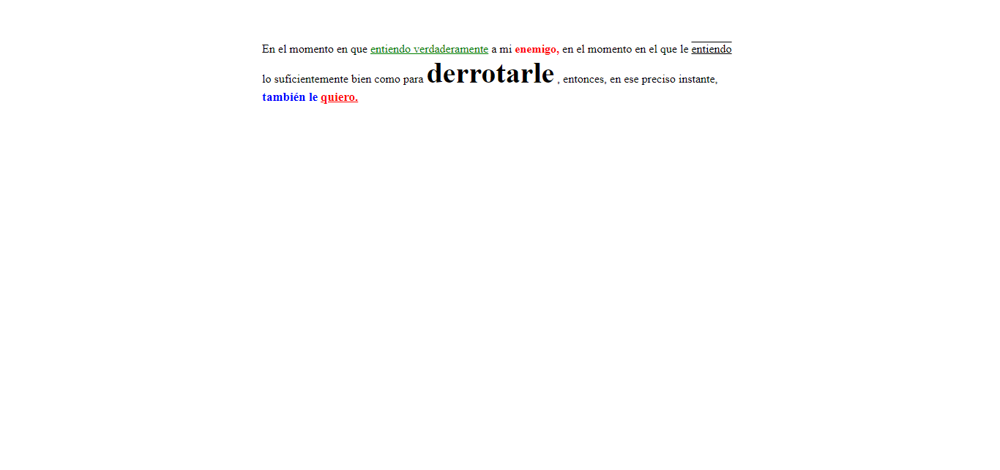

<h1>Taller 9 - Jaqueline Gonzalez Marentes</h1>

<h2>Información</h2>

Curso: Full stack Basico - Grupo 1

Profesor: Cristian Patiño

<h2>Link de la pagina web</h2>

<h2>Punto 1: Link de figma</h2>
<a href="https://www.figma.com/file/53ngPzQGTVxwFsKTA5vbqd/Jaqueline-gonzalez?type=design&node-id=0%3A1&mode=design&t=XdXKvwfWsTDqNl77-1">Link de Figma</a>

<h2>Punto 2: Diseño en HTML</h2>

<h2>Punto 3: Diseño con CSS</h2>

<h2>Punto 4: Titulos </h2>

<h2>Punto 5: Parrafo</h2>

<h2>Punto 6: Links</h2>

<h2>Punto 7 y 8: Navegación</h2>

<h2>Punto 9: Tabla</h2>